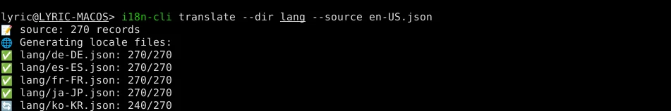

# i18n-cli

A command-line interface (CLI) tool that utilizes the OpenAI API to translate locale files based on JSON format.



## Install

```bash
go install github.com/pandodao/i18n-cli@v0.0.3
```

## Usage

```bash
export OPENAI_API_KEY=YOUR_API_KEY
i18n-cli translate --dir ./locales --source en-US.json
```

in which,

- `--dir ./locales`: This flag specifies the directory where the locale files are located. The value `./locales` specifies that the locales directory is located in the current working directory.
- `--source en-US.json`: This flag specifies the source locale file to be used as a reference for translation. The value `en-US.json` specifies that the en-US locale file is located in the locales directory.

`i18n-cli` reads the directory containing locale files, retrieves translations from OpenAI, and then writes the translated content back to the same files.

To have `i18n-cli` translate the content of a JSON locale file, any existing values will be ignored. 

If you want `i18n-cli` to translate a specific value, you can add a "!" at the beginning of the string. Alternatively, you can delete the key/value pair from the JSON file to have `i18n-cli` generate a new translation.
